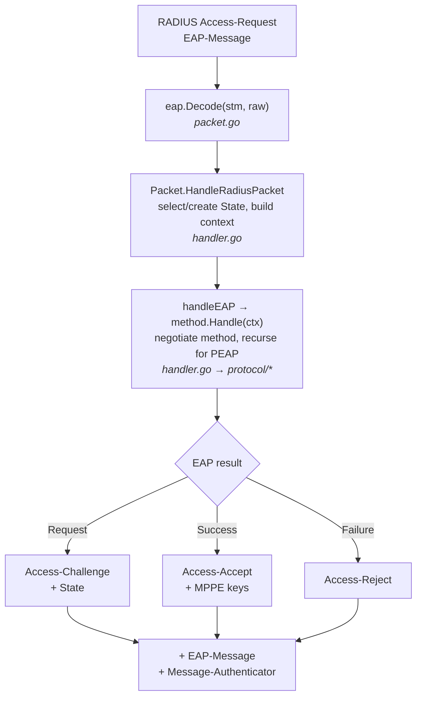

# radius-eap — RFC reference & architecture

This document is the entry point for understanding how the library works and how
it maps onto the relevant RFCs. Each protocol has its own detailed reference:

| Protocol | EAP Type | Spec | Reference |
|----------|---------|------|-----------|
| EAP core | — | RFC 3748 | [protocol/eap/_RFC.md](protocol/eap/_RFC.md) |
| Identity | 1 | RFC 3748 Section 5.1 | [protocol/identity/_RFC.md](protocol/identity/_RFC.md) |
| Legacy Nak | 3 | RFC 3748 Section 5.3.1 | [protocol/legacy_nak/_RFC.md](protocol/legacy_nak/_RFC.md) |
| GTC | 6 | RFC 3748 Section 5.6 | [protocol/gtc/_RFC.md](protocol/gtc/_RFC.md) |
| EAP-TLS | 13 | RFC 5216 / 9190 | [protocol/tls/_RFC.md](protocol/tls/_RFC.md) |
| PEAP | 25 | draft-josefsson / draft-kamath | [protocol/peap/_RFC.md](protocol/peap/_RFC.md) |
| MS-CHAP-v2 | 26 | RFC 2759 / 3079 | [protocol/mschapv2/_RFC.md](protocol/mschapv2/_RFC.md) |

## Request lifecycle



- **`handler.go`** drives the EAP state machine: method negotiation, Nak
  handling, Identifier management (RFC 3748 Sections 4.1-4.2), and emits the RADIUS
  response with a recomputed **Message-Authenticator** (RFC 2869).
- **`context.go`** is the per-request `protocol.Context`: protocol-state access,
  the session-scoped store (`SessionValue`/`SetSessionValue`), response
  modifiers, and inner-method routing.
- **`packet.go`** wraps decode/encode of the root EAP packet.

## The StateManager contract

A consumer supplies a `protocol.StateManager` (`protocol/state.go`):

```go
GetEAPSettings() Settings          // method set, priorities, per-method settings
GetEAPState(key string) *State     // load persisted session state (nil if new)
SetEAPState(key string, st *State) // persist session state
```

`State.SessionData` (guarded, see below) is a session-scoped store that survives
across RADIUS round-trips. `eap.NewMemoryStateManager(settings, ttl)`
(`memory_state.go`) is a ready-to-use, concurrency-safe implementation with TTL
eviction — use it instead of re-implementing a map that never evicts abandoned
sessions.

## Reliability guarantees

- **Race-free.** The EAP-TLS/PEAP handshake runs on a background goroutine while
  request handlers run on others; all shared state goes through a mutex-guarded
  `BuffConn` and `State` accessors. The whole module passes `go test -race`,
  including a real TLS 1.2/1.3 handshake driven through the bridge
  (`protocol/tls/buff_conn_test.go`). CI runs a dedicated `-race` job.
- **State-safe.** Session state is keyed by RADIUS State; `SessionData` access is
  mutex-protected so it is safe to use from background TLS callbacks.
  `MemoryStateManager` bounds memory with TTL eviction.
- **DoS-bounded.** Fragmented TLS messages are capped (`MaxMessageSize`, default
  64 KiB) and abandoned handshakes time out (10 s) — no unbounded buffering or
  goroutine leaks.
- **Spec-faithful.** EAP Codes/Types, EAP-TLS flags & key export, MS-CHAPv2
  field layout, and PEAP protected-result handling are asserted by per-file
  tests against their RFC clauses.

## Testing

Run `make test` (unit + `eapol_test` integration) and `make test-race` (race
detector). Every source file with behavior has a matching `_test.go`; pure
type-declaration files (`*/state.go`) have none by design.
