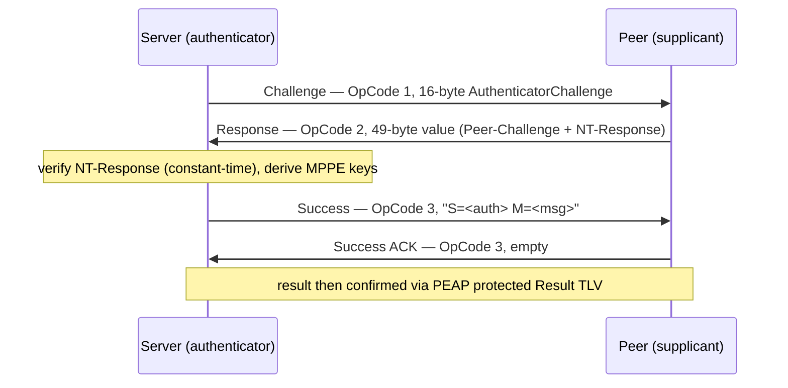

# EAP-MS-CHAP-v2 — RFC 2759 / RFC 3079

EAP method **Type 26**. Microsoft's challenge/handshake authentication, run as
the PEAP phase-2 inner method. Mutual authentication via NT-hash-derived
responses plus MPPE key derivation for link encryption.

## Specifications

- **RFC 2759** — Microsoft PPP CHAP Extensions, Version 2 (the core algorithm:
  challenges, NT-Response, Authenticator-Response).
- **RFC 3079** — Deriving MPPE keys from MS-CHAP-v2 credentials.
- **draft-kamath-pppext-eap-mschapv2** — the EAP encapsulation of the above.

## Message flow (RFC 2759 Sections 4-8)

### Response value layout (RFC 2759 Section 4, 49 octets)

| Offset | Size | Field |
|--------|------|-------|
| 0  | 16 | Peer-Challenge |
| 16 | 8  | Reserved (MUST be zero) |
| 24 | 24 | NT-Response |
| 48 | 1  | Flags |

## Working logic & file map

| File | Responsibility |
|------|----------------|
| `payload.go` | Decodes/encodes the MS-CHAPv2 packet (`OpCode`, `MSCHAPv2ID`, `MS-Length`, `ValueSize`). `Handle`: issues the 16-byte server Challenge (from `crypto/rand` via `securecookie`), parses the peer Response, asks the consumer to authenticate, compares the expected vs received NT-Response with **`bytes.Equal` (constant-time)**, then drives Success → protected Result. `ModifyRADIUSResponse` attaches MS-MPPE-Recv/Send keys on Access-Accept. |
| `op_response.go` | `ParseResponse` validates the 49-octet Response: exact length, **all-zero reserved octets** (Section 4), and extracts Peer-Challenge / NT-Response / Flags. |
| `op_success.go` | `SuccessRequest.Encode` emits the Success packet (OpCode 3 + "S=…" Authenticator-Response); unlike Challenge it has no ValueSize octet. |
| `settings.go` | `AuthenticateRequest` / `AuthenticateRequestWithContext` are the consumer hooks returning the expected `NTResponse`, `AuthenticatorResponse`, and MPPE `RecvKey`/`SendKey`. `DebugStaticCredentials` is a fixed-credential helper for testing only. |
| `state.go` | Per-session `Challenge`, `PeerChallenge`, `AuthResponse`, and `IsProtocolEnded`. |

## Security notes

- The server **never sees the password**; the consumer computes responses from a
  stored NT hash (RFC 2759 Section 8). NT-Response comparison is constant-time.
- The server Challenge is cryptographically random per session.
- MS-CHAPv2 is cryptographically weak in isolation; it is only safe **inside the
  PEAP TLS tunnel**, which is how this package is wired.

## Tests

`payload_test.go` (decode/handle/MPPE), `op_response_test.go` (RFC 2759 Section 4
layout, reserved-zero rule, Type 26), `op_success_test.go` (Section 5 encoding),
`settings_test.go` (RFC 2759/3079 material, determinism).
