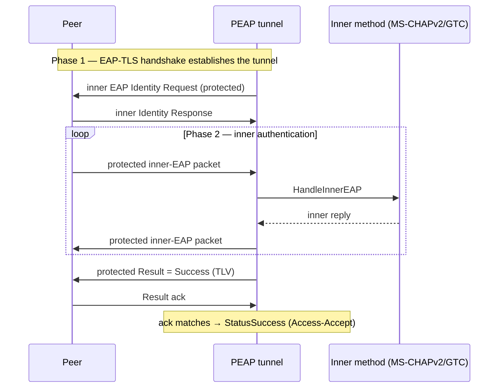

# PEAP (PEAPv0) — draft-josefsson / draft-kamath

EAP method **Type 25**. Protected EAP: a TLS tunnel (phase 1) protecting a second
EAP method (phase 2, typically MS-CHAPv2 or GTC). The peer's real credentials
are exchanged only inside the tunnel.

## Specifications

- **draft-josefsson-pppext-eap-tls-eap** — PEAP.
- **draft-kamath-pppext-peapv0-00 Section 1.1** — the PEAPv0 inner-EAP encoding (the
  inner EAP packet omits its header).
- **RFC 5216** — the TLS phase reuses the EAP-TLS transport (`../tls`).
- **RFC 2759 / RFC 3748 Section 5.6** — the inner methods (`../mschapv2`, `../gtc`).

## Structure

PEAP is constructed as a TLS payload wrapping a PEAP payload wrapping an inner
EAP payload:

```
Protocol() = tls.Payload{ Inner: peap.Payload{ Inner: eap.Payload{} } }
```

Phase 1 (TLS handshake) is handled entirely by `../tls`. Once the tunnel is up,
the TLS layer delegates each protected record to the PEAP `Payload`.

## Working logic & file map

| File | Responsibility |
|------|----------------|
| `payload.go` | The PEAP tunnel logic. `Handle`: on start it sends an inner EAP Identity Request; thereafter it decodes the inner EAP packet (`eapInnerDecode`), dispatches it to the inner method via `HandleInnerEAP`, and wraps the reply. **PEAP also acts as a nested `StateManager`** (`GetEAPSettings`→`InnerProtocols`, `GetEAPState`/`SetEAPState`→`SubState`), so the inner methods get their own settings and state scoped to the tunnel. |
| `extension.go` | The protected **Result TLV** exchange (EAP Extensions, inner Type 33). `ExtensionPayload.Decode`/`Encode`/`ResultStatus` convey Success/Failure inside the tunnel so the outcome is cryptographically protected. |
| `extension_avp.go` | Encoding/validation of a single Extension AVP/TLV (Mandatory bit, reserved-bit rejection, length bounds). |
| `settings.go` | `Config` (tunnel `*tls.Config`), `InnerProtocols` (the phase-2 method set/priority/settings), `MaxMessageSize`. |
| `state.go` | `SubState` (per-inner-method state) and `AwaitingResultAVPAck`. |

## Inner-EAP encoding (draft-kamath Section 1.1)

Inside the tunnel the inner EAP packet is sent **without its 4-byte header** for
ordinary methods — `eapInnerDecode` reconstructs the header (Code/ID/Length)
from the outer packet before decoding, and `Encode` strips it again. EAP
Extension (Result TLV) packets are the exception: they are carried as full EAP
packets.

## Result protection flow

1. Inner method authenticates (e.g. MS-CHAPv2 success).
2. Server sends a protected **Result = Success** TLV; `AwaitingResultAVPAck` is
   set.
3. Peer must reply with a matching Result TLV; only then does PEAP end with
   `StatusSuccess`. A missing/!=Success ack ends with `StatusError`.

This prevents a man-in-the-middle from forging the final result outside the
tunnel.



## Tests

`payload_test.go` (tunnel + inner dispatch + Result ack), `extension_test.go`,
`extension_avp_test.go`, `settings_test.go` (Type 25, config). End-to-end
PEAP-MSCHAPv2 via `eapol_test` in `../../tests`.
