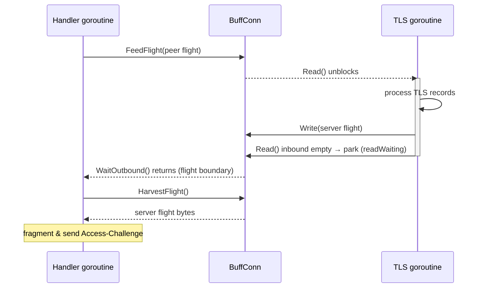

# EAP-TLS — RFC 5216

EAP method **Type 13**. Establishes a TLS session inside EAP, providing mutual
certificate authentication and exported keying material for link encryption. It
is also the transport layer reused by PEAP (`../peap`).

## Specifications

- **RFC 5216** — EAP-TLS Authentication Protocol (framing, fragmentation, key
  hierarchy).
- **RFC 5247** — MSK/EMSK key framework.
- **RFC 8446 / RFC 5246** — TLS 1.3 / 1.2 (the actual handshake, via Go
  `crypto/tls`).

## Packet format (RFC 5216 Section 3.1)

```
+-+-+-+-+-+-+-+-+
|L M S R R R R R|   Flags
+-+-+-+-+-+-+-+-+
|   TLS Message Length (4 bytes, only if L=1)   |
+-----------------------------------------------+
|   TLS Data ...
```

- **L** (`FlagLengthIncluded`, 0x80): the 4-byte total length is present (first
  fragment of a message).
- **M** (`FlagMoreFragments`, 0x40): more fragments follow.
- **S** (`FlagTLSStart`, 0x20): EAP-TLS Start (server's opening packet).

## Concurrency model (the core of "race-free / state-safe")

`crypto/tls` expects a blocking `net.Conn`, but EAP delivers TLS bytes one RADIUS
round-trip at a time. We bridge the two with **one long-lived handshake
goroutine** and a sequence of short-lived request-handler invocations that
communicate through `BuffConn`:

```
handler goroutine                 BuffConn                 TLS goroutine
  FeedFlight(peer flight) ───────► inbound ──────────────► Read()
  WaitOutbound() ◄───────────────────────────────◄ Write(server flight) / park
  HarvestFlight() ◄────────────── outbound
```

The boundary signal is deterministic: the TLS goroutine has finished a flight
exactly when its `Read` finds the inbound buffer empty and parks
(`readWaiting`). `BuffConn` is fully mutex-guarded and uses a broadcast channel
for wakeups — **no polling, no data race** (verified under `-race`, including a
real TLS 1.2/1.3 handshake driven through two `BuffConn`s in
`buff_conn_test.go`).



## Working logic & file map

| File | Responsibility |
|------|----------------|
| `payload.go` | EAP-TLS packet `Decode`/`Encode`; `Handle` is the per-round driver — starts TLS (`tlsInit`), feeds reassembled peer flights, waits for the handshake goroutine, fragments outbound flights (`startChunkedTransfer`/`sendNextChunk`), and resolves the final status (`awaitFinalStatus`). `tlsHandshakeFinished` exports keying material and runs the consumer callback. `ModifyRADIUSResponse` writes the MS-MPPE keys on Access-Accept. |
| `buff_conn.go` | `BuffConn`: the race-free in-memory `net.Conn`. `Read`/`Write` for the TLS goroutine; `FeedFlight`/`WaitOutbound`/`HarvestFlight` for the handler. |
| `reassembly.go` | `inboundReassembler` reassembles fragmented peer messages (L/M flags) at the EAP layer and enforces the **maximum message size** (default 64 KiB) — a DoS guard per RFC 5216 Section 3.1. Keeps `BuffConn` a pure byte pipe (SRP). |
| `state.go` | `State`: per-session TLS handshake state, synchronization primitives, fragmentation bookkeeping, exported keys. Documented inline with its concurrency model. |
| `flags.go` | The RFC 5216 Section 3.1 Flags bits. |
| `inner.go` | For PEAP: reads/writes the protected inner-EAP records over the established TLS conn. |
| `settings.go` | Consumer configuration: `*tls.Config`, verify hooks (with `protocol.Context`), `HandshakeSuccessful` callback, `MaxMessageSize`. |

## Key derivation (RFC 5216 Section 2.3)

After the handshake, `tlsHandshakeFinished` exports 128 octets of keying
material via TLS-Exporter:

- **TLS 1.2**: label `"client EAP encryption"`.
- **TLS 1.3**: label `"EXPORTER_EAP_TLS_Key_Material"` with context `[TypeTLS]`
  (RFC 9190).

The first 32 octets become MS-MPPE-Recv-Key and octets 64..96 become
MS-MPPE-Send-Key (`ModifyRADIUSResponse`). TLS 1.3 additionally sends the
**protected success indication** (`0x00` application byte,
`queueProtectedSuccessIndicator`) per RFC 9190.

## Hardening

- Maximum reassembled message size bounded (`MaxMessageSize`, default 64 KiB).
- Stale/abandoned handshakes are bounded by `staleConnectionTimeout` (10 s); the
  context-cancel arm of `BuffConn.Read` guarantees the handshake goroutine
  cannot leak.
- Unexpected post-handshake client data (e.g. TLS alerts) is detected and
  rejected (`failOnUnexpectedPostHandshakeClientData`).
- Certificate verification hooks (`VerifyConnection`, `VerifyPeerCertificate`)
  run for resumed connections too; see `settings.go` doc comments.

## Tests

`payload_test.go`, `buff_conn_test.go` (race-free handoff + real handshake),
`reassembly_test.go` (fragmentation + size bound), `state_test.go`,
`flags_test.go`, `inner_test.go`, `settings_test.go`. End-to-end via `eapol_test`
in `../../tests`.
